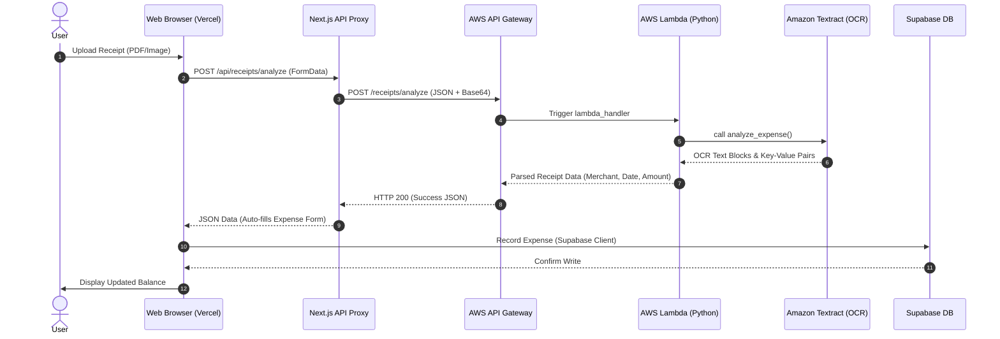

# SplitDude 🚗🏠🍔

SplitDude is a premium, serverless group expense splitter and debt simplifier built with a modern, glassmorphic UI. It features serverless AWS receipt OCR parsing and a robust Supabase database setup with strict Row-Level Security (RLS) policies.

[](https://nextjs.org/)
[](https://react.dev/)
[](https://www.typescriptlang.org/)
[](https://aws.amazon.com/)
[](https://supabase.com/)
[](LICENSE)

🚀 **Live Demo**: [https://split-dude-v2.vercel.app](https://split-dude-v2.vercel.app)

---

## 📸 Application Screenshots

Below are placeholders for the user interface screens:

| View | Screenshot Placeholder | Description |
| :--- | :---: | :--- |
| **Landing Page** | `` | Product landing page & onboarding |
| **Home** | `` | User central feed & activity logs |
| **Dashboard** | `` | Financial summaries, active balances, visual graphs |
| **Groups** | `` | Active group lists & member ledgers |
| **Expense Modal** | `` | Bill split configurations (equal, exact, percentage) |
| **Receipt OCR** | `` | Serverless AWS Textract scanning in action |
| **Friends** | `` | Friend directory & Split ID search requests |
| **Notifications** | `` | Settlement requests, join requests, activity alerts |
| **Profile** | `` | Unique Split ID, avatar updates |
| **Settings** | `` | Security preference toggles |

---

## ⚡ Key Features

| Feature | Description | Technical Implementation |
| :--- | :--- | :--- |
| 🛡️ **Privacy-First Identity** | No telephone numbers required. Users connect using a random, unique Split ID. | Trigger-generated unique alphanumeric codes (`SPDXXXXXX`) in Supabase. |
| 🧾 **Serverless Receipt OCR** | Auto-extract merchant, total bill amount, and date from a receipt image or PDF. | Next.js API proxying base64 payload to AWS Lambda & Amazon Textract. |
| 🧮 **Greedy Debt Simplification** | Reduces total group transactions using a greedy graph-reduction algorithm. | Max-heap sorted creditor/debtor balance resolution algorithm. |
| ⚡ **Real-Time Suggestions** | Instant list autocomplete on keypress when adding group members. | Client-side memory filtering of pre-cached TanStack Query friends list. |
| 🎨 **Premium Glassmorphic UI** | Responsive, dark-themed dashboard with hardware-accelerated animations. | Tailwind CSS, Framer Motion cards, and custom CSS variables. |

---

## 🏗️ System Architecture

SplitDude is built around a secure, serverless infrastructure. The Next.js API route handles authentication and forwards complex file operations to AWS API Gateway, keeping client workloads minimal and secure.



For a detailed breakdown of the components and data flows, check the [Architecture Documentation](docs/Architecture.md).

---

## 🛠️ Tech Stack & AWS Services

### Core Frameworks
* **Frontend**: Next.js 16 (App Router), React 19, TypeScript, Tailwind CSS, Framer Motion
* **Database**: PostgreSQL (Supabase) with strict RLS (Row-Level Security)
* **State & Caching**: TanStack React Query v5

### AWS Serverless Services Used
* **AWS API Gateway**: Exposes HTTP routes securely from Vercel without exposing backend Lambda endpoints.
* **AWS Lambda (Python 3.12)**: Handles temporary file creation, base64 decoding, S3 interaction, and calls Textract.
* **Amazon Textract**: Uses machine learning to locate merchant name, date, and final billing total.
* **Amazon S3**: Temporary staging bucket with a 1-day lifecycle expiration rule for privacy and cost efficiency.

For more details on AWS deployment, check the [AWS Configuration Guide](docs/AWS.md).

---

## 📂 Project Structure

```
├── .github/                   # GitHub templates & CI workflows
│   ├── ISSUE_TEMPLATE/        # Structured Bug, Feature, and Question forms
│   └── workflows/             # Build validation GitHub Action scripts
├── backend/                   # AWS cloud integrations
│   └── lambdas/               # Python receipt OCR Lambda functions
├── database/                  # SQL database schema and migrations
├── docs/                      # Comprehensive technical documentation
│   ├── Architecture.md        # Technical data flows & simplification algorithm
│   ├── AWS.md                 # Lambda code & API Gateway details
│   ├── Database.md            # Supabase database schema & trigger scripts
│   ├── API.md                 # API Route Handler specifications
│   ├── Security.md            # Authentication, RLS policies, CORS
│   ├── Performance.md         # React Query caching & in-memory suggestions
│   └── Deployment.md          # Step-by-step production setup guide
├── public/                    # Static image assets and logos
├── src/                       # Next.js frontend code
│   ├── app/                   # App Router pages and API routes
│   ├── components/            # Reusable UI widgets and layout shells
│   └── lib/                   # Utility helpers, hooks, and debt algorithms
└── package.json               # Package configurations & metadata
```

---

## ⚙️ Environment Variables

Create a `.env.local` file at the root of the project. See [`.env.example`](.env.example) for reference:

| Name | Example Value | Description |
| :--- | :--- | :--- |
| `NEXT_PUBLIC_SUPABASE_URL` | `https://your-proj.supabase.co` | Supabase project endpoint |
| `NEXT_PUBLIC_SUPABASE_ANON_KEY` | `eyJhbGciOi...` | Supabase anonymous API public key |
| `AWS_API_GATEWAY_URL` | `https://xyz.execute-api.us-east-1.amazonaws.com/dev` | AWS API Gateway Invoke URL |

---

## 🚀 Local Installation

1. Clone the repository and navigate to the project directory:
   ```bash
   git clone https://github.com/Sairamparasa/SplitDudeV2.git
   cd SplitDudeV2
   ```
2. Install the package dependencies:
   ```bash
   npm install
   ```
3. Set up your `.env.local` variables based on the table above.
4. Run the development server:
   ```bash
   npm run dev
   ```
5. Open [http://localhost:3000](http://localhost:3000) on your web browser to check.

To verify a production compilation locally, run:
```bash
npm run build
```

---

## 🛡️ Security & Performance

* **Row-Level Security (RLS)**: Users can never read or mutate other users' groups, friends, or expenses. All reads verify the authenticated UUID against database membership tables. Read the [Security Guide](docs/Security.md).
* **TanStack Query Caching**: Ensures data is cached locally and invalidates keys dynamically on modifications to prevent stale pages. Read the [Performance & Caching Guide](docs/Performance.md).
* **No Database Polling**: Real-time friend search operates client-side over memory arrays on keystroke.

---

## 🗺️ Future Roadmap

- [ ] **Settle via UPI / Venmo QuickLinks**: Generate payment links directly inside suggested settlements.
- [ ] **Multi-Currency Converter**: Support recording expenses in multiple currencies with auto-conversions.
- [ ] **Line-Item Split**: Support split calculations based on individual items on a single receipt.
- [ ] **Push Notifications**: Integrate native push notification alerts when added to new groups.

---

## 🤝 Contributing

We welcome contributions from the open-source community! Please review [CONTRIBUTING.md](CONTRIBUTING.md) to understand our commit conventions, branch naming structure, and pull request procedures.

---

## 📄 License

Distributed under the **MIT License**. See [`LICENSE`](LICENSE) for details.

---

## ✍️ Author

* **Sairam Parasa** - [GitHub](https://github.com/Sairamparasa) - [LinkedIn](https://linkedin.com/in/sairam-parasa)

---

## 💖 Acknowledgements

* [Contributor Covenant](https://www.contributor-covenant.org) for the Code of Conduct.
* Amazon Web Services for the serverless OCR infrastructure.
* Supabase for the database layer and Auth.
