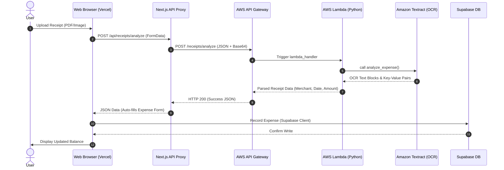

# System Architecture & Algorithms

This document provides a comprehensive overview of the SplitDude application architecture, data flow, and core computational algorithms.

## Architecture Diagram

The following Mermaid sequence diagram illustrates the user flow and request routing through SplitDude's Next.js frontend, Supabase Database, AWS API Gateway, Lambda, and Textract.



---

## Core Algorithms: Debt Simplification

When a group has multiple members and complex transactions, calculating who owes whom can result in a high volume of transactions. SplitDude uses a **Debt Simplification Algorithm** (located in `src/lib/utils/debt-simplifier.ts`) to minimize the total number of transactions required to settle all debts.

### Mathematical Formulation

Let \(M\) be the set of members in a group.
For each member \(i \in M\), we compute their **Net Balance** \(B_i\) as:

\[B_i = \text{Total Paid by } i - \text{Total Share of } i\]

* If \(B_i > 0\), member \(i\) is a **creditor** (they paid more than their share and should receive money).
* If \(B_i < 0\), member \(i\) is a **debtor** (they paid less than their share and owe money).
* If \(B_i = 0\), member \(i\) is fully settled.

By definition, the sum of all net balances must equal zero:

\[\sum_{i \in M} B_i = 0\]

### Greedy Heap-Based Calculation

To simplify settlements, the algorithm processes the net balances using a greedy approach with two lists (or max-heaps):

1. **Creditors List**: Contains all members with \(B_i > 0\), sorted in descending order.
2. **Debtors List**: Contains all members with \(B_i < 0\), sorted in ascending order of their absolute debt (i.e. largest debtors first).

On each step, the algorithm:
1. Picks the largest creditor \(C\) (who is owed the most) and the largest debtor \(D\) (who owes the most).
2. Calculates the settlement amount \(A\) as:
   \[A = \min(B_C, |B_D|Task)\]
3. Registers a transaction: **\(D\) pays \(A\) to \(C\)**.
4. Updates the balances:
   * \(B_C \leftarrow B_C - A\)
   * \(B_D \leftarrow B_D + A\)
5. If the updated \(B_C > 0\), \(C\) is placed back in the Creditors List.
6. If the updated \(B_D < 0\), \(D\) is placed back in the Debtors List.
7. Repeats until all balances are zero (within floating-point tolerance).

### Code Walkthrough (`debt-simplifier.ts`)

```typescript
export function simplifyDebts(netBalances: Record<string, number>, members: Member[]): SuggestedSettlement[] {
  const settlements: SuggestedSettlement[] = [];

  // Separate creditors and debtors
  let creditors = Object.entries(netBalances)
    .filter(([_, bal]) => bal > 0.01)
    .map(([id, bal]) => ({ id, balance: bal }));

  let debtors = Object.entries(netBalances)
    .filter(([_, bal]) => bal < -0.01)
    .map(([id, bal]) => ({ id, balance: -bal })); // store absolute value

  // Sort descending
  creditors.sort((a, b) => b.balance - a.balance);
  debtors.sort((a, b) => b.balance - a.balance);

  while (creditors.length > 0 && debtors.length > 0) {
    const creditor = creditors[0];
    const debtor = debtors[0];

    const amount = Math.min(creditor.balance, debtor.balance);
    
    const payerName = members.find((m) => m.id === debtor.id)?.full_name || 'Unknown';
    const payeeName = members.find((m) => m.id === creditor.id)?.full_name || 'Unknown';

    settlements.push({
      from: debtor.id,
      fromName: payerName,
      to: creditor.id,
      toName: payeeName,
      amount: parseFloat(amount.toFixed(2))
    });

    creditor.balance -= amount;
    debtor.balance -= amount;

    // Remove or update items
    if (creditor.balance < 0.01) {
      creditors.shift();
    } else {
      creditors.sort((a, b) => b.balance - a.balance);
    }

    if (debtor.balance < 0.01) {
      debtors.shift();
    } else {
      debtors.sort((a, b) => b.balance - a.balance);
    }
  }

  return settlements;
}
```

This greedy algorithm is guaranteed to settle all balances in at most \(N-1\) transactions (where \(N\) is the number of members), which is mathematically optimal for simplifying multi-party debts.
